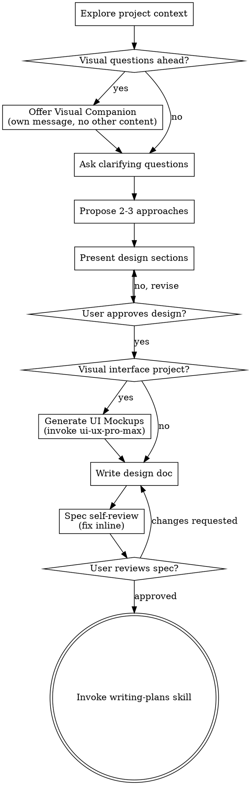

# Brainstorming Ideas Into Designs

Help turn ideas into fully formed designs and specs through natural collaborative dialogue.

Start by understanding the current project context, then ask questions one at a time to refine the idea. Once you understand what you're building, present the design and get user approval.

<HARD-GATE>
Do NOT invoke any implementation skill, write any code, scaffold any project, or take any implementation action until you have presented a design and the user has approved it. This applies to EVERY project regardless of perceived simplicity.
</HARD-GATE>

## Anti-Pattern: "This Is Too Simple To Need A Design"

Every project goes through this process. A todo list, a single-function utility, a config change — all of them. "Simple" projects are where unexamined assumptions cause the most wasted work. The design can be short (a few sentences for truly simple projects), but you MUST present it and get approval.

## Checklist

Use the TaskCreate tool to create exactly these tasks and complete them in order:

1. **Explore project context** — check files, docs, recent commits
2. **Offer visual companion** (if the project involves any visual interface — web, mobile, dashboard, UI components) — this is its own message, not combined with a clarifying question. See the Visual Companion section below. Step 6 (Generate UI Mockups) depends on the companion being active. If you skip this step, mockup generation in Step 6 will be significantly degraded.
3. **Ask clarifying questions** — one at a time, understand purpose/constraints/success criteria
4. **Propose 2-3 approaches in the browser** — Write each approach as HTML content to the visual companion. Show architecture diagrams and trade-off comparisons side-by-side. Do NOT use terminal text for this step if the companion is running.
5. **Present design in the browser** — Write each design section as HTML to the visual companion. Architecture, component tree, data flow — present all of them visually. Get user approval after each section. Do NOT present design sections in terminal text when the companion is running.
6. **Generate UI Mockups** (visual/UI projects only) — invoke ui-ux-pro-max, generate HTML design tokens and screen mockups. Skip for non-visual projects. See Step 6 section below.
7. **Write design doc** — save to `docs/superpowers/specs/YYYY-MM-DD-<topic>-design.md` and commit
8. **Spec self-review** — quick inline check for placeholders, contradictions, ambiguity, scope (see below)
9. **User reviews written spec** — ask user to review the spec file before proceeding
10. **Transition to implementation** — invoke writing-plans skill to create implementation plan

Do NOT merge or skip any of these tasks. Each one must be a separate TaskCreate call.

## Process Flow



**The terminal state is invoking writing-plans.** Do NOT invoke frontend-design, mcp-builder, or any other implementation skill. The ONLY skill you invoke after brainstorming is writing-plans.

## The Process

**Understanding the idea:**

- Check out the current project state first (files, docs, recent commits)
- Before asking detailed questions, assess scope: if the request describes multiple independent subsystems (e.g., "build a platform with chat, file storage, billing, and analytics"), flag this immediately. Don't spend questions refining details of a project that needs to be decomposed first.
- If the project is too large for a single spec, help the user decompose into sub-projects: what are the independent pieces, how do they relate, what order should they be built? Then brainstorm the first sub-project through the normal design flow. Each sub-project gets its own spec → plan → implementation cycle.
- For appropriately-scoped projects, ask questions one at a time to refine the idea
- Prefer multiple choice questions when possible, but open-ended is fine too
- Only one question per message - if a topic needs more exploration, break it into multiple questions
- Focus on understanding: purpose, constraints, success criteria

**Exploring approaches:**

- Propose 2-3 different approaches with trade-offs
- Present options conversationally with your recommendation and reasoning
- Lead with your recommended option and explain why

**Presenting the design:**

- Once you believe you understand what you're building, present the design
- **If the visual companion is running, present each design section in the browser.** Write HTML content for architecture diagrams, component trees, and data flow — push them to the companion. Keep terminal text to brief transition messages.
- Ask after each section whether it looks right so far
- Cover: architecture, components, data flow, error handling, testing
- Be ready to go back and clarify if something doesn't make sense

**Design for isolation and clarity:**

- Break the system into smaller units that each have one clear purpose, communicate through well-defined interfaces, and can be understood and tested independently
- For each unit, you should be able to answer: what does it do, how do you use it, and what does it depend on?
- Can someone understand what a unit does without reading its internals? Can you change the internals without breaking consumers? If not, the boundaries need work.
- Smaller, well-bounded units are also easier for you to work with - you reason better about code you can hold in context at once, and your edits are more reliable when files are focused. When a file grows large, that's often a signal that it's doing too much.

**Working in existing codebases:**

- Explore the current structure before proposing changes. Follow existing patterns.
- Where existing code has problems that affect the work (e.g., a file that's grown too large, unclear boundaries, tangled responsibilities), include targeted improvements as part of the design - the way a good developer improves code they're working in.
- Don't propose unrelated refactoring. Stay focused on what serves the current goal.

## After the Design

**Documentation:**

- Write the validated design (spec) to `docs/superpowers/specs/YYYY-MM-DD-<topic>-design.md`
  - (User preferences for spec location override this default)
- Use elements-of-style:writing-clearly-and-concisely skill if available
- Commit the design document to git

**Spec Self-Review:**
After writing the spec document, look at it with fresh eyes:

1. **Placeholder scan:** Any "TBD", "TODO", incomplete sections, or vague requirements? Fix them.
2. **Internal consistency:** Do any sections contradict each other? Does the architecture match the feature descriptions?
3. **Scope check:** Is this focused enough for a single implementation plan, or does it need decomposition?
4. **Ambiguity check:** Could any requirement be interpreted two different ways? If so, pick one and make it explicit.

Fix any issues inline. No need to re-review — just fix and move on.

**User Review Gate:**
After the spec review loop passes, ask the user to review the written spec before proceeding:

> "Spec written and committed to `<path>`. Please review it and let me know if you want to make any changes before we start writing out the implementation plan."

Wait for the user's response. If they request changes, make them and re-run the spec review loop. Only proceed once the user approves.

**Implementation:**

- Invoke the writing-plans skill to create a detailed implementation plan
- Do NOT invoke any other skill. writing-plans is the next step.

## Key Principles

- **One question at a time** - Don't overwhelm with multiple questions
- **Multiple choice preferred** - Easier to answer than open-ended when possible
- **YAGNI ruthlessly** - Remove unnecessary features from all designs
- **Explore alternatives** - Always propose 2-3 approaches before settling
- **Incremental validation** - Present design, get approval before moving on
- **Be flexible** - Go back and clarify when something doesn't make sense

## Visual Companion

A browser-based companion for showing mockups, diagrams, and visual options during brainstorming.

**Offering the companion:** When you anticipate that upcoming questions will involve visual content (mockups, layouts, diagrams), offer it once for consent:
> "Some of what we're working on might be easier to explain if I can show it to you in a web browser. I can put together mockups, diagrams, comparisons, and other visuals as we go. This feature is still new and can be token-intensive. Want to try it? (Requires opening a local URL)"

**This offer MUST be its own message.** Do not combine it with clarifying questions, context summaries, or any other content. The message should contain ONLY the offer above and nothing else. Wait for the user's response before continuing. If they decline, proceed with text-only brainstorming.

**When the visual companion is running:**

- **Step 3 (Clarifying questions)**: Terminal is fine for text questions.
- **Step 4 (Propose approaches)**: Use the browser to show side-by-side visual comparisons of each approach. Architecture diagrams, component layouts, and trade-off tables are ALL visual content.
- **Step 5 (Present design)**: EVERY design section MUST be presented in the browser. Write HTML content for each section as you present it. Architecture, component tree, data flow, error handling — push all of them to the visual companion. Do not present design sections in plain terminal text when the companion is available.
- **Step 6 (Generate UI Mockups)**: All mockup files go to the visual companion's screen_dir.

**The rule: once the companion server is running, the browser becomes the primary presentation surface for Steps 4, 5, and 6.** The terminal is for clarification questions (Step 3) and brief transition messages. Do not let the browser sit empty while presenting visual content in the terminal.

If they agree to the companion, read the detailed guide before proceeding:

`skills/brainstorming/visual-companion.md`

## Step 6: Generate UI Mockups (Visual Projects Only)

**Decision:** Does the project involve any visual interface (web, mobile, dashboard, landing page, data visualization)? If NO, skip to Step 7.

### 6a. Invoke ui-ux-pro-max skill

Use the Skill tool to invoke `ui-ux-pro-max`. This loads the full design intelligence context — 161 UX rules, 50+ styles, color/typography databases, and pre-delivery checklist. If the skill is not available, skip to Step 7 and inform the user.

### 6b. Locate CLI script

Use the `UI_UX_PRO_MAX_SCRIPT` path from the session context (injected by the SessionStart hook). If not available, discover it with:

```bash
find ~/.claude/plugins/cache/ui-ux-pro-max-skill -name search.py -path "*/ui-ux-pro-max/scripts/*" | sort -V | tail -1
```

If not found, skip to Step 7 and tell the user to install ui-ux-pro-max.

### 6c. Run design intelligence queries

Use the script path discovered in 6b to generate design data. Default to `--stack vue`:

```bash
python3 "$SCRIPT" "<product type> <industry> <style keywords>" --design-system --stack vue -p "<project name>"
python3 "$SCRIPT" "<query>" --domain color
python3 "$SCRIPT" "<query>" --domain typography
python3 "$SCRIPT" "<query>" --domain ux
```

### 6d. Generate tokens page

Write `ui-01-tokens.html` to the visual companion's `screen_dir` (or `docs/superpowers/mockups/` if no companion is running). Content: color swatches with hex values, typography samples (heading/body/code), spacing scale — all using actual token values from the 6c output.

### 6e. Generate screen mockups

For each screen/page identified in the approved design (Step 5), generate an HTML mockup file using the visual companion's mockup CSS classes. Use design tokens from 6d for colors, typography, and spacing. Name files sequentially: `ui-02-<name>.html`, `ui-03-<name>.html`, etc. Generate all screens in one pass.

### 6f. Generate combined view

Write `ui-all-screens.html` combining all mockups with section headers and navigation. Present to user via the visual companion URL.

### 6g. User approval

<HARD-GATE>
Present the mockups to the user. If the visual companion is running, point them to the URL. If not, tell them the file paths. Then ASK the user: "Does the UI design look good, or would you like any changes?" DO NOT proceed to Step 7 until the user explicitly approves the visual direction. Iterate on any screens that need changes and ask again.
</HARD-GATE>

**Principle:** ui-ux-pro-max is a design data source, not a replacement for brainstorming's conversational flow. Its output is the basis for discussion; final decisions are confirmed by the user.
